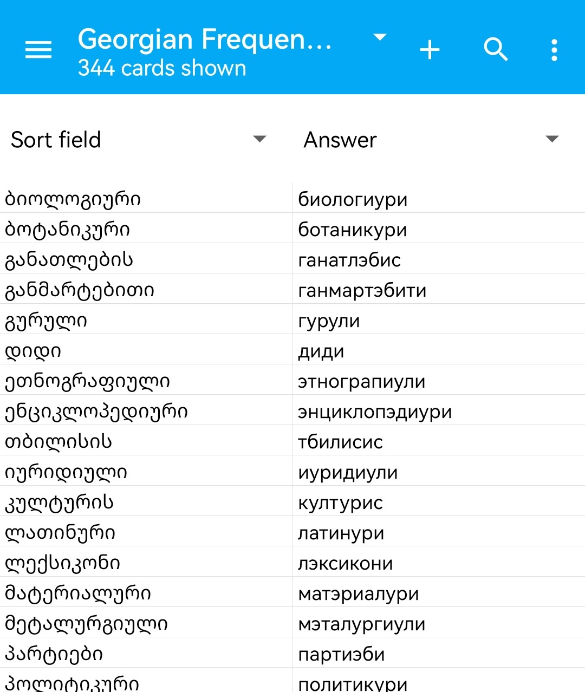

# Georgian Anki Card Generator

A command-line tool to automate the creation of Anki flashcards for learning the Georgian alphabet. It extracts Georgian text from images, transliterates it to Cyrillic, and generates ready-to-import Anki decks (`.apkg`).

## Features
*   **OCR Extraction:** Extract Georgian text from images using Tesseract (supports modern and old scripts).
*   **Transliteration:** Automatically transliterates Georgian characters (modern Mkhedruli script, 33 symbols) to their Cyrillic approximations.
*   **Deck Generation:** Create new Anki decks or update existing ones with new cards.

## Setup (Linux)

### 1. System Dependencies
Install Tesseract OCR engine and Georgian language data:
```bash
sudo apt-get install tesseract-ocr tesseract-ocr-kat
```

### 2. Python Environment
Create a virtual environment and install the project dependencies:
```bash
# Create virtual environment
python3 -m venv venv

# Activate virtual environment
source venv/bin/activate

# Install dependencies
pip install .
```

## Usage

Run the tool using the python script in the `src` directory.

### 1. Extract Text from Images
```bash
python3 src/anki_ge.py extract image1.jpg image2.png -o extracted.txt
```

### 2. Transliterate Text
```bash
python3 src/anki_ge.py transliterate extracted.txt -o transliterated.txt
```

### 3. Create Anki Deck
```bash
python3 src/anki_ge.py create-deck transliterated.txt -n "My Georgian Deck"
```

### 4. Update Existing Deck
```bash
python3 src/anki_ge.py create-deck new_words.txt --update "My_Georgian_Deck.apkg" -n "My Georgian Deck"
```

### Options
*   `--log {DEBUG,INFO,WARNING,ERROR}`: Set logging level (default: INFO).

## Example

### Georgian Frequency Dictionary Set

[Dataset](text/georgian_freq_list_4_100.txt) credits: [@akalongman](https://github.com/akalongman/geo-words)

#### 1. Transliteration
```bash
python3 src/anki_ge.py transliterate text/georgian_freq_list.txt -o dict/ge_freq_dict.txt
```

#### 2. Deck creation
```bash
python3 src/anki_ge.py create-deck dict/ge_freq_dict.txt --name "Georgian Frequency Deck"
```



